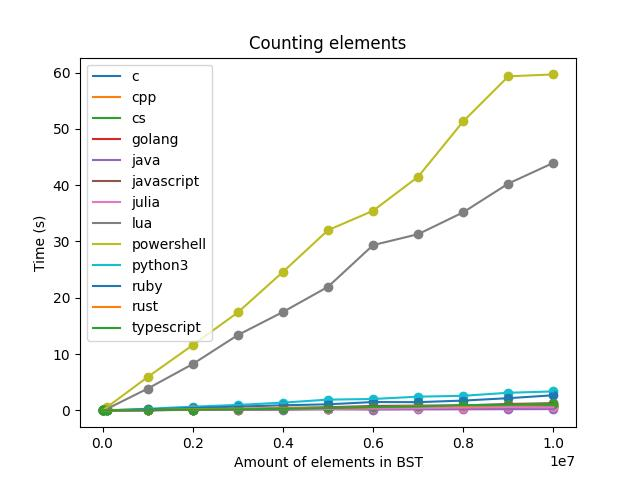

# BST_100

## Implementation of BST in various programming languages

This project consists of implementations of BST (Binary Search Tree) in various programming languages. A BST is a data structure that allows for fast searching, adding, and removing of elements in logarithmic time. Each of the implementations has been performance-tested by performing 5,000,000 additions of numbers to the tree, followed by 10,000,000 checks to see if the tree contains elements.

## Implementations

The project currently includes implementations of BST in multiple languages.
Each implementation is located in a separate directory in the repository.
All implementations are based on two classes, Node and Tree.

The **Node** class represents a single node in the BST. It contains an integer value and references to its left and right child nodes. The class provides methods to add a value, check if a value is present, calculate the length (number of nodes) in the subtree, and calculate the height (maximum depth) of the subtree.

The **Tree** class serves as the entry point for interacting with the BST. It maintains a reference to the root node of the tree and provides methods to add a value, check if a value is present, calculate the length of the tree, and calculate the height of the tree.

In some cases, the implementation may differ depending on the language.

## How to add new implementation?

You need to create PR and folder in ./BST. Remeber, that this folder should contain only alphanumerical characters.
Also, you need to create conf.yaml with following keys:
 - image_name
 - run_command
 - build_command [optional]

[Main file with 'BST Workflow'](.github\workflows\main.yaml) will be updated and "test_lang-[folder_name].yaml" file in [workflows folder](.github\workflows) will be created by [Create Jobs](.github\workflows\create_jobs.yaml).

## Performance tests

The following tests were conducted:

- 5 million elements were added to the tree.
- 10 million checks were performed to see if an element exists.
- The time to count the elements in the tree was measured.
- The height of the tree was calculated.

  Each test was repeated 3 times and then the average was calculated.
  Final BST has 5.000.000 elements and 57 levels

Here are the performance test results for each implementation:

[Here](https://kaisermovet.github.io/BST_100/) you can find more details

## Requirements

To run the code in each language, you will need to have Docker installed.

## Running the code

To run the code in each language, navigate to the appropriate directory in the repository and run `./run.sh`.
